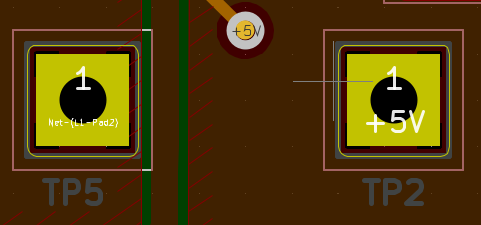

# Board Build

4 Layer board to emulate the final design's temperature caracteristics. 

The board is 50*72mm. Output is on two banana Jacks. Voltage input is on two solder/TH pads.  

Inductor current can be probed by placing a wire between these pads: 

