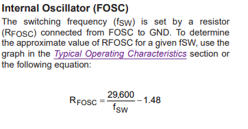
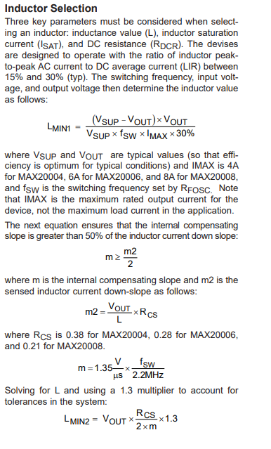
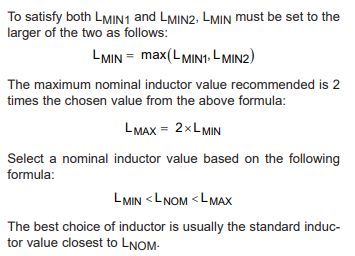
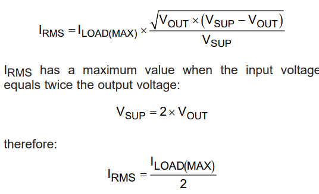
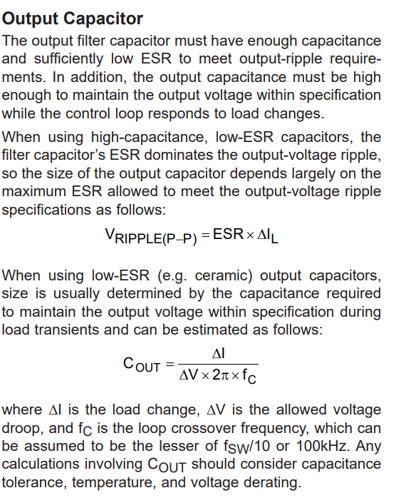
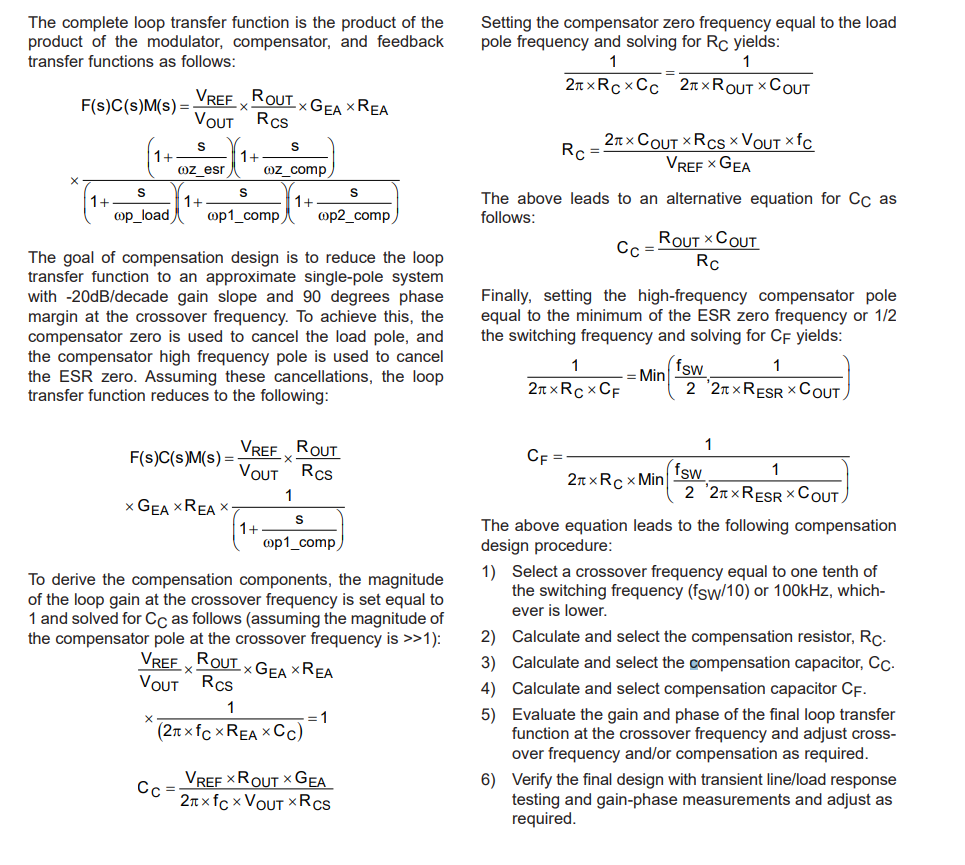
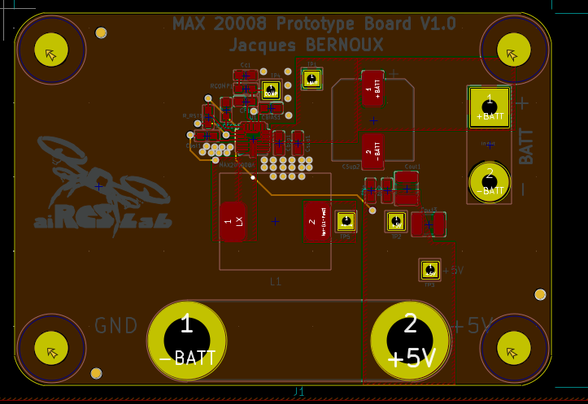
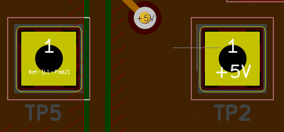

This repo contains my work on the MAX20008 buck converter. The *Gerbers* folder contains the fabrication outputs, the *BOM+CPL* folder contains the BOM and CPL. 

## Component Dimensioning & Notes on PCB design

## Power supply : MAX 20008 

 In the board dimensioning file from the V1 MUAV Board I estimated that the eventual current draw of the MUAV board would be at least 6A (generous estimate).  I chose the MAX20008 buck converter, rated for 8A RMS. Here i detail the steps i took to dimension the different components . 

### RFOSC : 

using a Lower Fosc = lower temp increase, i chose fosc = 250Khz

with Fosc in kHz and Rosc in kohm 

We choose FOSC = 250kHz , RFOSC= 120 kohm soit 110kohm (E96) -> fosc = 243kHz

### power inductor 

Lmin1: we take Vin = 22.2V (nominal batt voltage)
m=0,15
Lmin1 = 6.5µH \\
Lmin2 = 11.1µH \\
Lmin = 6.5µH \\
Lmax = 6.8µH \\ 

we choose Lnom = 8.2µH, IMAX =8A, ISAT = 10A  : SRP1265C-100M : ISAT = 20A, Irms = 12A, L =10µF (no 8.2 µH available at this time)

### Input capacitor : 

Cin = 4.7µF minimum, capacitors used :GRT188R6YA475KE13 , LCSC part nb : C711100
Cbyp = 100nF, GRT188R6YA475KE13 type from murata , LCSC part nb : C85960

Celec = 47µF,  nichicon low esr 250mohm, LCSC part nb: C473201 

 

Iload(max) = 8A tehrefore Irms = 4A . Input cap should exhibit less than 10°c rise in temp at rms input current

Use low ESR cap 

### Output capacitor : 

 

we take DeltaV max = 50mV, Delta I = 2A,  fc = 10KHz 

Cout = 63µF min, we take  Cout= 100µF part nb =  GRM32ER61A107ME20L

### Compensation circuitry : 

GEA = 780µS, REA = 1.5MOhm   CHECK VALUES!!! -> DNP on PCB for now

We dimension RC = 8.8K, 
             CC = 39nF, 
             CF= 9nF 

### Reverse polarity protection: 

I added a  SB1060L schottky diode in series with Vin +, 
Forward voltage = 0. 55V , rated 10A . TO 277B package

JLCPCB part nb: C2929649

## Board Build

4 Layer board to emulate the final design's temperature caracteristics. 

The board is 50*72mm. Output is on two banana Jacks. Voltage input is on two solder/TH pads.  

Inductor current can be probed by placing a wire between these pads: 

